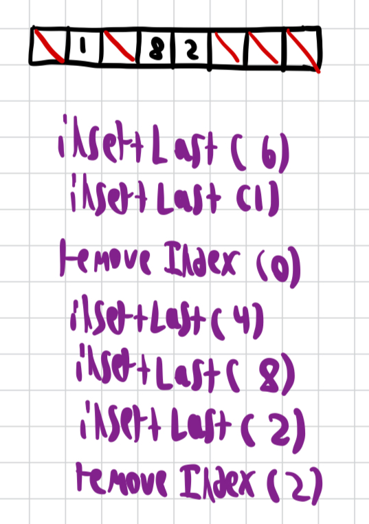

### 1. What is an array?

An array $A$ is collection of elements which exist in a contiguous sequence in memory. Unlike sets, arrays can store multiple identical elements. An array assigns each element an index $i$ which is that element's position in the array. Arrays support 4 operations: Access, Search, Insertion, and Deletion.

### 2. Static Array

Assume we want to create an array which holds 10 integers. First lets create an empty array $A$ of size 10 and type int, which in C looks something like $\text{int A[10]}$. By creating $A$, now have a 'base pointer' to a specific memory address, say 0x1000, which is where the array will start. Because we created an array of size 10 and each integer takes 4 bytes to store, the compiler will allocate all memory addresses from 0x1000 to 0x1040 as reserved memory for $A$.
This memory is reserved even if our array is empty. This is because we created a static array, meaning the memory is allocated during compile time instead of on the heap at runtime. A static array is called so because its size cannot be changed without reallocating the entire array.

#### 2A. Access

The $i^{th}$ element in an array is stored in $A[i-1]$, so the first element in an array is $A[0]$. This may seem counterintuitive, but there's a good explanation when we examine how array indexing gets translated to assembly. When we access $A[k]$, we are really accessing the element in memory address $\text{base pointer} + b* k$, where $b$ is the number of bytes needed to represent whatever type of element $A$ is storing. So in our example, if we access $A[3]$ we are  going to memory address $\text{0x1000} + 4 * 3 = \text{0x1012}$. If $k=0$ then using our equation the memory address is just at $\text{base pointer} + 4 * 0 = \text{base pointer}$ which is exactly what we want.
 This equation is why arrays must be allocated in a contiguous sequence in memory. If we have the index of an element, **we can access that element in $O(1)$** using this equation.

*1-indexed arrays use the formula $\text{base pointer} + (k-1) * b$ for indexing.*

#### 2B. Search

But how do we get that index of a particular element $t$ if we don't already know it? We must check whether each element is equal to $t$ for all elements in the array until we find a match or have looked through the entire array. If we find a match, we can return the corresponding index to make future lookups of that element constant time, but because we have to iterate through all elements the first time **we get a time complexity of $O(n)$.**

#### 2C. Insertion

 Imagine our array of size 10 is completely full and we try to add another integer to the end of it. The memory which we allocated from 0x1000 to 0x1040 is all used up, and 0x1044 might already be used for something else. So we have to reallocate a new array of size 11 somewhere else in memory, copy over all the old integers, and then add the new one. Even if we added an integer to the middle of the array at index $m$ we would have to copy over all elements with indices larger than $m$ to their current address + 4 bytes, meaning we still have to use 0x1044 for our array which isn't possible.

Because we have to reallocate and copy over the entire array somewhere new in memory for every insertion, **we have a time complexity of $O(n)$.**

#### 2D. Deletion

If we want to delete an element at index $i$ from the array, we have to shift all elements to the right of $i$ one position to the left, so $A[i]=A[i+1],A[i+1]=A[i+2],etc.$ When we are done shifting we set the last value to $NULL$ and decrement the size of our array by 1. **This takes $O(n)$ time because that is how many elements can be to the right of $i$.** An exception is if you are deleting the last element - in this case there are no elements to the right, so it would take $O(1)$ time to delete.

*Note that although you are deleting an element, the number of bytes reserved for your static array never changes.*

### 3. Dynamic arrays

A limitation of static arrays is that they need to be reallocated, resized, and copied for every insertion no matter where it is, which takes $O(n)$ time. While the maximum size of a static array must be provided upon initialization and cannot be changed during the programs execution, the maximum size of a dynamic arrays can be changed while the program is running. Inserting an element at the end of the array takes $O(1)_a$ time. Access, search, and deletion are identical to static arrays.

#### 3A. Insertion

When we inserted in a static array, we reallocated a new array which had the size of the old array plus one. In dynamic arrays, we reallocate a new array which has the size of the old array times 2 (or some other constant). Image our max array size is $n$, there are $n-1$ elements in the array, and we insert one element at the end of the array. We would resize to a new array of size $2n$ with $n$ elements in the array. But now it would take $n$ more insertions until we resize again which would take $O(n)$ time. With this amortized analysis we have our $O(1)_a$ runtime for inserting at the end of a dynamic array.

Typically, to be on the safe side you set a resize threshold of say 0.75. Now, you resize when the ratio of the number of elements in your array to the max array size exceeds this threshold.

Inserting at an arbitrary index $i$ still takes $O(n)$ time because just like in static arrays, we have to shift all elements with indices larger than $i$ to the right by 1.

### 4. C for Dynamic Arrays

This C code doesn't include imports and assumes all allocations are successful and indices are in the correct range.

```c
typedef struct {
    int* array;
    size_t used;
    size_t size;
    double resizeThreshold;
} DynamicArray;

void initArray(DynamicArray* a, int initialSize) {
    a->array = (int*)malloc(initialSize * sizeof(int)) // int is 4 bytes
    a->used = 0;
    a->size = initialSize;
    a->resizeThreshold = 0.75;
}

void insertArray(DynamicArray* a, int element, int index) {
    double loadFactor = (double)a->used / a->size;
    if (loadFactor > a->resizeThreshold) {
        a->size *= 2; // prepare to copy full array to new array twice as long
        int* temp = (int*)realloc(a->array, a->size * sizeof(int));
        a->array = temp;
    }
    // shift elements to the right to make room for new element
    for (int i = a->used; i > index; i--) {
        a->array[i] = a->array[i-1]
    }
    a->array[index] = element;
    a->used++
}

int searchArray(DynamicArray* a, int element) {
    for (size_t i = 0; i < a->used; i++) {
        if (a->array[i] == element) {
            return i;
        }
    }
    return -1; // Element not found
}

void deleteArray(DynamicArray* a, int index) {
    for (size_t i = index; i < a->used - 1; i++) {
        a->array[i] = a->array[i + 1]; // Shift elements down to fill the gap
    }
    a->used--;
}
```

### 5. Runtime Comparison and Example

| Operation | Static Array | Dynamic Array |
| ------------- | ------------ | ------------- |
| Access | $O(1)$ | $O(1)$ |
| Search| $O(n)$ | $O(n)$ |
| Insertion anywhere | $O(n)$ | $O(n)$ |
| **Insertion at end** | $O(n)$ | $O(1)_a$ |
| Deletion anywhere | $O(n)$ | $O(n)$ |
| Deletion at end | $O(1)$ | $O(1)$ |

Elements can clump together depending on the order of operations performed. Here we have a static array of size 8 with 2 operations being performed: insertLast which takes a number to insert, and removeIndex which takes an index to remove.


