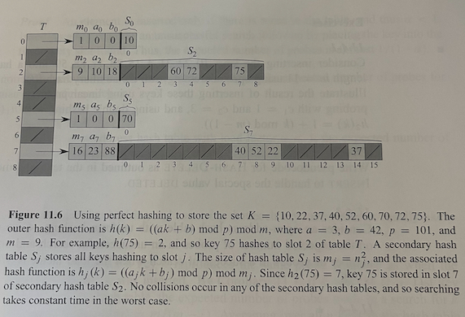

# Hash function

*Sources:*

1. **CLRS**
2. Stanford [[notes]](https://stanford-cs161.github.io/winter2023/assets/files/lecture8-notes.pdf)
3. MIT 6.006 - Hashing basics [[video]](https://www.youtube.com/watch?v=Nu8YGneFCWE&ab_channel=MITOpenCourseWare)
4. MIT 6.006 - Hashing with chaining [[video]](https://www.youtube.com/watch?v=0M_kIqhwbFo&ab_channel=MITOpenCourseWare)
5. MIT 6.006 - Open Addressing, Crypto Hashing [[video]](https://www.youtube.com/watch?v=rvdJDijO2Ro&ab_channel=MITOpenCourseWare)
6. MIT 6.046 - Universal and Perfect Hashing [[video]](https://www.youtube.com/watch?v=z0lJ2k0sl1g&t=60sab_channel=MITOpenCourseWare)

Hash functions are extremely widely used, and for good reason. They let you create **hash tables** which have the following access times for a set of keys $K$.

|             | Average | Worst Case |
| -------     | ------- | ---------- |
|**Build**    | $O(n)$  |$O(n)$      |
|**Access**   | N/A     |$O(n)$      |
|**Search**   |$O(1)$   |$O(n)$      |
|**Insertion**|$O(1)_a$  |$O(n)$      |
|**Deletion** |$O(1)_a$  |$O(n)$      |

Although the worst case time is as bad as a linked list, in practice hashing performs extremely well. If $K$ never changes once stored, perfect hashing can support searches in worst-case $O(1)$!

**A hash function has four primary objectives.**

1. Minimize collisions while maximizing load factor $\sigma = \frac{\text{num items stored}}{\text{array size}}$
2. Resolve any existing collisions
3. Uniform distribution of hash values
4. Easy to calculate

## 1. Direct Address Tables

The universe $U$ of $K$ is all possible keys that could exist. If $U=\{0,1,\ldots,m-1\}$ where $m$ is reasonably small, we can create an array, or direct address table, denoted by $T[0,\ldots,m-1]$ in which each position corresponds to a key in $U$. If a set contains no element with key $k$, then $T[k]= NIL$. Note that $T$ is stored in memory and $\vert T \vert = \vert U \vert$.

Instead of storing an elements' key and satellite data in an external object with a pointer from a position in the table to the object, we can store the object in the slot itself, thus saving space. In such applications we need a special key within the object to indicate an empty slot.

However, direct access tables are only efficient if $U$ is small. What if we are trying to store some phone numbers - more specifically, certain 10 digit numbers with some satellite information like age and gender. In this case, $\vert U \vert = 9999999999 - 1000000000 = 8999999999$ meaning we would have to have a direct access table with nearly $9$ billion slots **regardless of how many phone numbers we're actually storing**. This means our load factor $\sigma$ is very small which is the opposite of what we want. This is why direct address tables are only efficient if $\vert K \vert << \vert U \vert$.

### 2. Hash tables and collisions

With direct addressing, an element with key $k$ is stored in slot $k$. With a hash function $h$, this element is stored in $h(k)$, which is the hash value. $h: U \rightarrow \{0,1, \ldots ,m-1\}$ where $m << \vert U \vert$. So instead of size $\vert U \vert$, the array has size $m$. Note that if you want to map $U \rightarrow \{0,1,\ldots,m+2\}$ you need to use a different hash function. Because we are mapping from a potentially infinite set to a finite set, there can be multiple keys with the same hash value via the [pigeonhole principle](https://www.geeksforgeeks.org/discrete-mathematics-the-pigeonhole-principle/). This situation called a 'collision' and there are two methods of resolving it: closed addressing and open addressing. Collisions are why operations in a hash table are $O(1)$ average instead of the $O(1)$ worst case from direct access tables.

#### 2A. Collision resolution - Closed Addressing

In closed addressing, each position in the hash table stores some data structure of entries that has to that position. Typically a Doubly Linked List (DLL) is used, but any Abstract Data Type that maintains a linear ordering of elements and supports insertion and deletion would work (for example, an array or heap). *Think: why are DLL's preferred?*

Now when a collision happens, we just add the new item to the end of the linked list. This is also called 'hashing with chaining' and means that if all items collide with the same hash value $h(x)$, we have 1 linked list at $T[h(x)]$ and get the $O(n)$ search performance of a linked list. However, a well designed hash function approaches a uniform distribution of hash values, so in practice this scenario rarely if ever happens.

#### 2B. Collision resolution - Open Addressing

In open addressing, all keys directly occupy the hash table itself whereas closed addressing the hash table was full of pointers to DLL's. Instead of following a chain of pointers, we compute the sequence of positions to be examined. The basic idea is to find another position within the hash table for a key when a collision occurs. This saves memory which can be used for more positions in the hash table. There are 3 major ways these sequences of positions are computed: linear probing, quadratic probing, and double hashing (which has the best results).

1. Linear Probing - We simply search for the next available slot in a linear sequence. This leads to clustering of hash values around particular sections which violates the uniform distribution.
2. Quadratic Probing - The interval between slots is increased by a quadratic function of the attempt number which reduces clumping.
3. Double Hashing - A secondary hash function is used to calculate the interval between probes. If we pick a good secondary hash function which evenly distributes the values, we get the best results of the 3 scenarios.

### 3. Examples of hash functions

But how does $h$ work? The simplest example is to simply use the length of the key as the index. This uses a property of the key itself to determine the index, and maps from $U \rightarrow \{0,1,\ldots,k\}$ where $k$ is the length of the longest key. This is not a great hash functions because of the large amount of collisions.

Consider the hash function $h(k) = k\mod p$ where $p$ is some large prime number. $h : U \rightarrow \{0,1,\ldots,p-1\}$. There are less collisions than our first hash functions and values are evenly distributed, but $h$ still isn't very well designed it's not cryptographically secure. Given $h(k)$, an attacker can try a range of values for $p$ and compute $k$ with non-negligible probability, which means the hash function is not pre-image resistant.

#### 3A. Universal Hashing

In universal hashing, a family of hash functions $H$ are generated using basic number theory **(pg.267)**. A hash function $h$ is then randomly picked from this family every time you hash a key. This is important because now you can prove the operations will work in $O(1)$ expected time without assuming the sequence of operations performed by the hash table is in random order, which is rarely the case.

The precise definition of a universal hash family $H$ is if for a randomly chosen hash function $h \in H$, the chance of a collision between distinct keys $k,l$ is less than or equal to $\frac{1}{m}$, where $m$ is the number of positions in our hash table. One can prove such a hash table achieves good $O(1)$ performance for each of the 4 operations in expectation **(Corollary 11.4)**.

### 4. Perfect Hashing

In perfect hashing, we have a static set of keys - for instance, the set of reserved words in a programming language. Using perfect hashing on a static set, we can **guarantee** $0$ collisions while using $O(n)$ memory. The perfect hashing scheme uses two levels of hashing, with universal hashing at each level. The first level serves the same function as hashing with chaining. We hash $n$ keys into $m$ slots using hash function $h$ carefully selected from the universal family $H$. However, instead of making a linked list of the keys hashing to slot $j$, we use a small secondary hash table $S_j$ with an associated hash function $h_j$. By choosing hash functions $h_j$ carefully, we can guarantee there are no collisions at the secondary level.

To guarantee no collisions at the secondary level, we need to let the size $m_j$ of hash table $S_j$ be the square of the number $n_j$ of keys hashing to position $s_j$. By choosing the first-level hash function well, we can limit the expected total space to O(n) with the help of **Theorem 11.9** which gives an upper bound of $\frac{1}{2}$ on the number of collisions (and explains the [birthday paradox](https://math.mit.edu/research/highschool/primes/circle/documents/2022/Elena%20&%20Alice.pdf)) and **Theorem 11.10** which gives $2n$ as upper bound on total number of positions required in secondary hash tables to ensure no collisions at the second level.

### 5. Misc

#### Hash Map vs. Hash Set

In a hash map, data is stored as objects whereas in a hash map, data is stored as key value pairs. In both data structures, no duplicate elements are allowed, although in a hash map you can have duplicate values.

#### Hash function cryptographic security definitions

1. Collision Vulnerability: $x_1,x_2$ produce the same hash output $h(x)$.
2. Pre-image Vulnerability: Given $h(x)$, it is computationally feasible to find $x$ that produces $h(x)$.
3. Second Pre-image Vulnerability: Given $x_1,h(x_1)$, it is feasible to find a different input $x_2\neq x_1$ such that $h(x_2) = h(x_1)$
